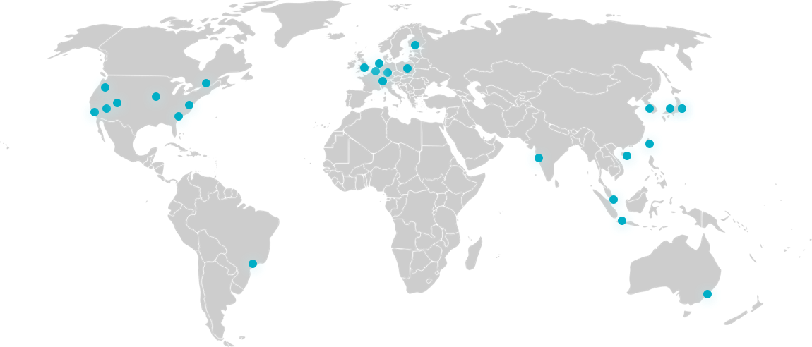

class: middle, center


# Deno Deploy の話

---

# 話す人


ひのさわ twitter @kt3k

Deno Land Inc. (2021年1月 ~)

- Deno Deploy の<br />フロントエンド周り開発
- Deno 自体の開発<br />(主に標準モジュール)

---

class: inverse, center, middle
# Deno Deploy <br />というサービスについて

---
class: middle
# Deno Deploy とは

- 2021年5月に Deno の会社 Deno Land Inc. より<br />ベータリリースされた Web サービス
- サーバーレス関数を提供するプラットフォーム
  - AWS Lambda、Google Cloud Functions、Cloudflare Workers などと競合するサービス

---
class: middle
# Deno Deploy とは

- Deno Deploy と紐付けた github レポジトリに push すると自動的にそのブランチがデプロイされる (URL 直指定でデプロイするオプションもあり)

---
class: middle
# Deno Deploy の特徴

- デプロイされたサーバーレス関数は (プロジェクト名).deno.dev というドメインからアクセスできるようになる
- メインブランチ以外のブランチへの push も本番相当環境にデプロイされて (プロジェクト名-hash値).deno.dev というドメインでホストされる
  - PR の確認環境が自動で出来る

---
# Deno Deploy の特徴

- アップロードされたサーバーレス関数は世界25リージョンに自動的に分散ホストされる (cf. [Anycast](https://en.wikipedia.org/wiki/Anycast))



---
# Deno Deploy の特徴

- プロジェクトを作ると (project名).deno.dev というドメインが与えられる。
- レポジトリのデフォルトブランチ以外への push もプレビュー環境として本番相当の環境にデプロイされる
  - PR ブランチの検証が本番相当環境でできる
- カスタムなドメインを紐づけることも(当然)できます。(Let's Encrypt 証明書自動更新付き)

---
# Deno Deploy の特徴
- ベータ期間中は無料。正式リリース後もある程度の無料枠がある予定。

https://deno.com/deploy

---
class: center, middle, inverse
# Deno と Deno Deploy の関係

---
# Deno の Architecture


- Deno は deno_core + Ops という構成をしている
- Ops を差し替える事で別の API を持った JavaScript runtime を作れるようになっている

---

# Deno と Deno Deploy の関係

```
Deno =
  deno_core
  + ops for Deno
  + tools

Deno Deploy =
  deno_core
  + ops for Deno Deploy
  + builtin server
```

大雑把にいうと deno_core の ops 部分を差し替えたものが Deno Deploy

---

# Deno と Deno Deploy の関係

共通すること
- モジュール解決 (URL import)
- TS サポート
- Web API ex. fetch, WebSocket, etc

---

# Deno と Deno Deploy の関係

違うこと
- OS の機能を直接使うような API は Deno Deploy にはない。 例. ファイル操作, サブプロセス起動 etc

---
class: middle, center, inverse
# サンプルコード

---

# サンプルコード

```ts
ddEventListener("fetch", (e) => {
  e.respondWith(
    new Response("Hello, world!", {
      status: 200,
    }), 
  );  
});
```

---

# サンプルコード sift

```ts
import {
  serve
} from "https://deno.land/x/sift@0.3.5/mod.ts";

serve({
  "/": () => new Response("hello world"),
  "/blog/:slug": (request, params) => {
    const post = `Hello, you visited ${params.slug}!`;
    return new Response(post);
  },
  // 上記のルートに合わなかった場合のルート
  404: () => new Response("not found"),
});
```

- 簡単なルーターを持ったライブラリの sift

---

# サンプルコード sift

```ts
import {
  h, json, jsx, serve
} from "https://deno.land/x/sift/mod.ts";

const App = () => (
  <div>
    <h1>Hello world!</h1>
  </div>
);
serve({
  "/": () => jsx(<App />),
  "/api": () => json({ message: "Hello world" }),
});
```

- JSX をレンダリングする機能もあり

---

# サンプルコード oak

```ts
import {
  Application
} from "https://deno.land/x/oak/mod.ts";

const app = new Application();

app.use((ctx) => {
  ctx.response.body = "Hello world!";
});

addEventListener("fetch", app.fetchEventHandler());
```

- Oak を使って普通の Express, Koa スタイルの開発も可能

---
class: middle, center, inverse
# 他のサービスとの比較

---
class: middle, center
# vs AWS Lambda

# vs AWS Lambda@Edge

# vs Cloudflare Workers

---

## vs AWS Lambda

- Lambda は他の AWS の種々のサービスと組み合わせて使うものなので、単純な比較は出来ない。
- API Gateway + Lambda という使い方と Deno Deploy で比較するとかなり似てる
- Lambda が1リージョンに限定されるのに対して、Deno Deploy はグローバルに分散ホストされる点が大きく違う

---

## vs AWS Lambda@Edge

- Lambda@Edge は Deno Deploy と同じく 20+リージョンに自動分散ホストされる
- が、Lambda@Edge はあくまで CloudFront ありきのサービスなので、Lambda@Edge だけでアプリケーションを作る事には適さない。
- Deno Deploy は Heroku のように、単体で完結したアプリケーションのプラットフォームになることを志向したサービス。

---

## vs Cloudflare Workers

- 一番 Deno Deploy に似ているサービスで、本当の意味での競合と言えるサービス
- リージョン数も全世界200+箇所に自動デプロイされる (Deno Deploy は25リージョン)
- import の解決はされない、TS はサポートされていない (ので、自前でビルドが必要) など、開発体験の面で機能差分がある。

---
class: middle, center

Deno Deploy が気になった人は<br />是非使ってみてください

https://deno.com/deploy
---

class: middle, center

ご清聴ありがとうございました。


https://deno.com/deploy
